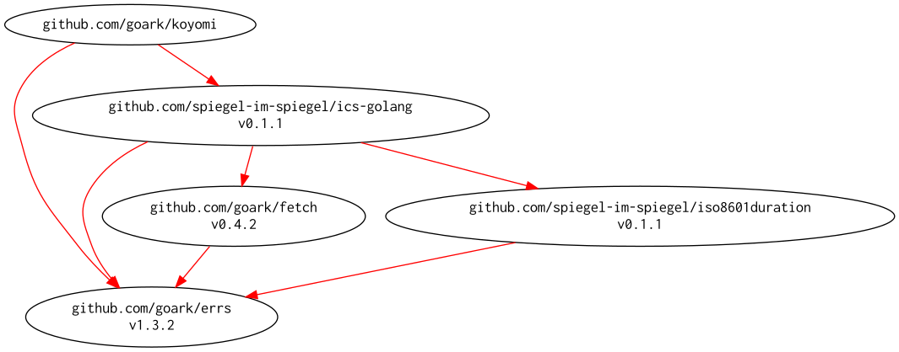

# [koyomi] -- 日本のこよみ

[](https://github.com/goark/koyomi/actions)
[](https://github.com/goark/koyomi/actions)
[](https://raw.githubusercontent.com/goark/koyomi/master/LICENSE)
[](https://github.com/goark/koyomi/releases/latest)

**Migrated repository to [github.com/goark/koyomi][koyomi]**

「[国立天文台 天文情報センター 暦計算室](http://eco.mtk.nao.ac.jp/koyomi/)」より日本の暦情報を取得する [Go 言語]用パッケージです。 Google Calendar を経由して取得しています。

取得可能な情報は以下の通りです。

```go
const (
    Holiday   CalendarID = iota + 1 //国民の祝日および休日
    MoonPhase                       //朔弦望
    SolarTerm                       //二十四節気・雑節
    Eclipse                         //日食・月食・日面経過
    Planet                          //惑星現象
)
```

## 簡単な使い方

### CSV 形式で出力

```go
start, _ := value.DateFrom("2019-05-01")
end := value.NewDate(time.Date(2019, time.May, 31, 0, 0, 0, 0, koyomi.JST))
k, err := koyomi.NewSource(
    koyomi.WithCalendarID(koyomi.Holiday, koyomi.SolarTerm),
    koyomi.WithStartDate(start),
    koyomi.WithEndDate(end),
).Get()
if err != nil {
    return
}

csv, err := k.EncodeCSV()
if err != nil {
    return
}
io.Copy(os.Stdout, bytes.NewReader(csv))
//Output:
//"Date","Title"
//"2019-05-01","休日 (天皇の即位の日)"
//"2019-05-02","休日"
//"2019-05-02","八十八夜"
//"2019-05-03","憲法記念日"
//"2019-05-04","みどりの日"
//"2019-05-05","こどもの日"
//"2019-05-06","休日"
//"2019-05-06","立夏"
//"2019-05-21","小満"
```

### テンプレートを指定して出力

```go
	start, _ := value.DateFrom("2019-05-01")
	end := value.NewDate(time.Date(2019, time.May, 31, 0, 0, 0, 0, value.JST))
	k, err := koyomi.NewSource(
		koyomi.WithCalendarID(koyomi.Holiday, koyomi.SolarTerm),
		koyomi.WithStartDate(start),
		koyomi.WithEndDate(end),
	).Get()
	if err != nil {
		return
	}

	myTemplate := `| 日付 | 曜日 | 内容 |
| ---- |:----:| ---- |
{{ range . }}| {{ .Date.StringJp }} | {{ .Date.WeekdayJp.ShortStringJp }} | {{ .Title }} |
{{ end -}}`

	t, err := template.New("").Parse(myTemplate)
	if err != nil {
		return
	}
	if err := t.Execute(os.Stdout, k.Events()); err != nil {
		return
	}
	//Output:
	//| 日付 | 曜日 | 内容 |
	//| ---- |:----:| ---- |
	//| 2019年5月1日 | 水 | 休日 (天皇の即位の日) |
	//| 2019年5月2日 | 木 | 休日 |
	//| 2019年5月2日 | 木 | 八十八夜 |
	//| 2019年5月3日 | 金 | 憲法記念日 |
	//| 2019年5月4日 | 土 | みどりの日 |
	//| 2019年5月5日 | 日 | こどもの日 |
	//| 2019年5月6日 | 月 | 休日 |
	//| 2019年5月6日 | 月 | 立夏 |
	//| 2019年5月21日 | 火 | 小満 |
```

## おまけ機能

### 西暦⇔和暦 変換

元号を含む和暦と西暦との変換を行います。
元号は以下のものに対応しています。

| 元号             | 起点           |
| ---------------- | -------------- |
| 明治（改暦以降） | 1873年1月1日   |
| 大正             | 1912年7月30日  |
| 昭和             | 1926年12月25日 |
| 平成             | 1989年1月8日   |
| 令和             | 2019年5月1日   |

#### 西暦から和暦への変換

```go
package main

import (
    "flag"
    "fmt"
    "os"
    "strconv"
    "time"

    "github.com/goark/koyomi/value"
)

func main() {
    flag.Parse()
    argsStr := flag.Args()
    tm := time.Now()
    if len(argsStr) > 0 {
        if len(argsStr) < 3 {
            fmt.Fprintln(os.Stderr, "年月日を指定してください")
            return
        }
        args := make([]int, 3)
        for i := 0; i < 3; i++ {
            num, err := strconv.Atoi(argsStr[i])
            if err != nil {
                fmt.Fprintln(os.Stderr, err)
                return
            }
            args[i] = num
        }
        tm = time.Date(args[0], time.Month(args[1]), args[2], 0, 0, 0, 0, time.Local)
    }
    te := value.NewDate(tm)
    n, y := te.YearEraString()
    if len(n) == 0 {
        fmt.Fprintln(os.Stderr, "正しい年月日を指定してください")
        return
    }
    fmt.Printf("%s%s%d月%d日\n", n, y, te.Month(), te.Day())
}
```

これを実行すると以下のような結果になります。

```
$ go run sample/sample1.go 2019 4 30
平成31年4月30日

$ go run sample/sample1.go 2019 5 1
令和元年5月1日
```

#### 和暦から西暦への変換

```go
package main

import (
    "flag"
    "fmt"
    "os"
    "strconv"
    "time"

    "github.com/goark/koyomi/value"
)

func main() {
    flag.Parse()
    argsStr := flag.Args()

    if len(argsStr) < 4 {
        fmt.Fprintln(os.Stderr, "元号 年 月 日 を指定してください")
        return
    }
    name := argsStr[0]
    args := make([]int, 3)
    for i := 0; i < 3; i++ {
        num, err := strconv.Atoi(argsStr[i+1])
        if err != nil {
            fmt.Fprintln(os.Stderr, err)
            return
        }
        args[i] = num
    }
    te := value.NewDateEra(value.EraName(name), args[0], time.Month(args[1]), args[2])
    fmt.Println(te.Format("西暦2006年1月2日"))
}
```

これを実行すると以下のような結果になります。

```
$ go run sample/sample2.go 平成 31 4 30
西暦2019年4月30日

$ go run sample/sample2.go 令和 1 5 1
西暦2019年5月1日
```

### 十干十二支を数え上げる

```go
package main

import (
    "flag"
    "fmt"
    "os"

    "github.com/goark/koyomi/value"
    "github.com/goark/koyomi/zodiac"
)

func main() {
    flag.Parse()
    args := flag.Args()
    if len(args) < 1 {
        fmt.Fprintln(os.Stderr, os.ErrInvalid)
        return
    }
    for _, s := range args {
        t, err := value.DateFrom(s)
        if err != nil {
            fmt.Fprintln(os.Stderr, err)
            continue
        }
        kan, shi := zodiac.ZodiacYearNumber(t.Year())
        fmt.Printf("Year %v is %v%v (Eho: %v)\n", t.Year(), kan, shi, kan.DirectionJp())
        kan, shi = zodiac.ZodiacDayNumber(t)
        fmt.Printf("Day %v is %v%v\n", t.Format("2006-01-02"), kan, shi)
    }
}
```

これを実行すると以下のような結果になります。

```
$ go run sample/sample3.go 2021-07-28
Year 2021 is 辛丑 (Eho: 南南東微南)
Day 2021-07-28 is 丁丑
```

### ユリウス日

```go
package main

import (
    "flag"
    "fmt"
    "os"

    "github.com/goark/koyomi/jdn"
    "github.com/goark/koyomi/value"
)

func main() {
    flag.Parse()
    args := flag.Args()
    if len(args) < 1 {
        fmt.Fprintln(os.Stderr, os.ErrInvalid)
        return
    }
    for _, s := range args {
        t, err := value.DateFrom(s)
        if err != nil {
            fmt.Fprintln(os.Stderr, err)
            continue
        }
        j := jdn.GetJDN(t.Time)
        fmt.Printf("Julian Day Number of %v is %v\n", t.Format("2006-01-02"), j)
    }
}
```

これを実行すると以下のような結果になります。

```
$ go run sample/sample4.go 2023-02-25
Julian Day Number of 2023-02-25 is 2460000
```

## Modules Requirement Graph

[](./dependency.png)

## Links

- [国立天文台 天文情報センター 暦計算室](https://eco.mtk.nao.ac.jp/koyomi/)
    - [今月のこよみ powered by Google Calendar - 国立天文台暦計算室](https://eco.mtk.nao.ac.jp/koyomi/cande/calendar.html)
    - [ユリウス日について - 国立天文台暦計算室](https://eco.mtk.nao.ac.jp/koyomi/topics/html/topics2023_1.html)
- [日本の暦情報を取得するパッケージを作ってみた — リリース情報 | text.Baldanders.info](https://text.baldanders.info/release/2020/05/koyomi/)

[Go 言語]: https://golang.org/ "The Go Programming Language"
[koyomi]: https://github.com/goark/koyomi "goark/koyomi: 日本のこよみ"
